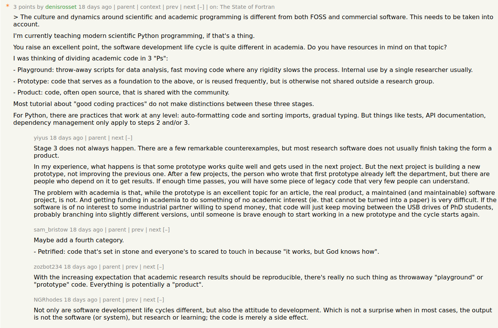

Code levels
===========

* **Playground** Throw-away scripts for data analysis, fast moving code where any rigidity 
  slows the process. Internal use by a single researcher usually.

* **Prototype** Code that serves as a foundation to the above, or is reused frequently,
  but is otherwise not widely shared with unknown people.

* **Product** Code, often open source, that is shared with the community.

* **Petrified**

Informally, the advice in this talk is divided in three levels:

Level 1
-------

(Playground)

Everything is contained in a single folder, without subdirectories.

Code is a few Python files. Dependencies are managed informally, or through a simple
``requirements.txt`` list. There is no packaging so that the project can be installed using
``pip install myproject``.

No specific virtual environment is used to developed the project, one often works with a single
e.g. Conda environment for all projects.

Documentation is in the form of Jupyter notebooks or Markdown files that are read directly
from the GitHub repository web interface.

Level 2
-------

(Prototype)

The project is managed, has a configuration file. We recommend Poetry to orchestrate all of this.

There is a clear structure that separates documentation, tests, and the package code.

The code is published to PyPI.

Documentation may be available in the form of a website.

Level 3
-------

(Product)

Additional infrastructure is put in place so that nothing bad happens in the future, and so that
users can trust that nothing breaks.

Academic projects rarely reach that stage.